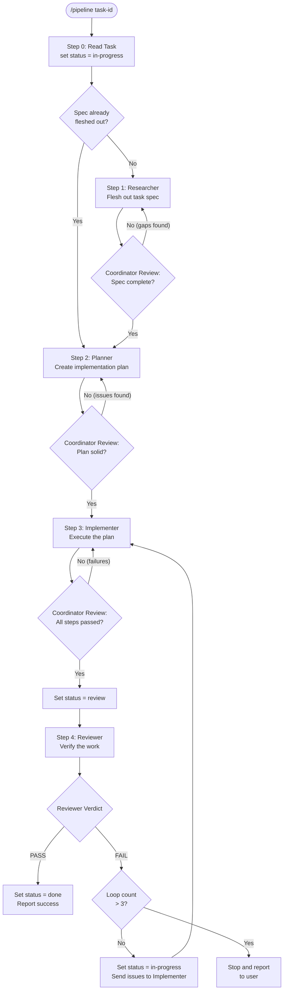
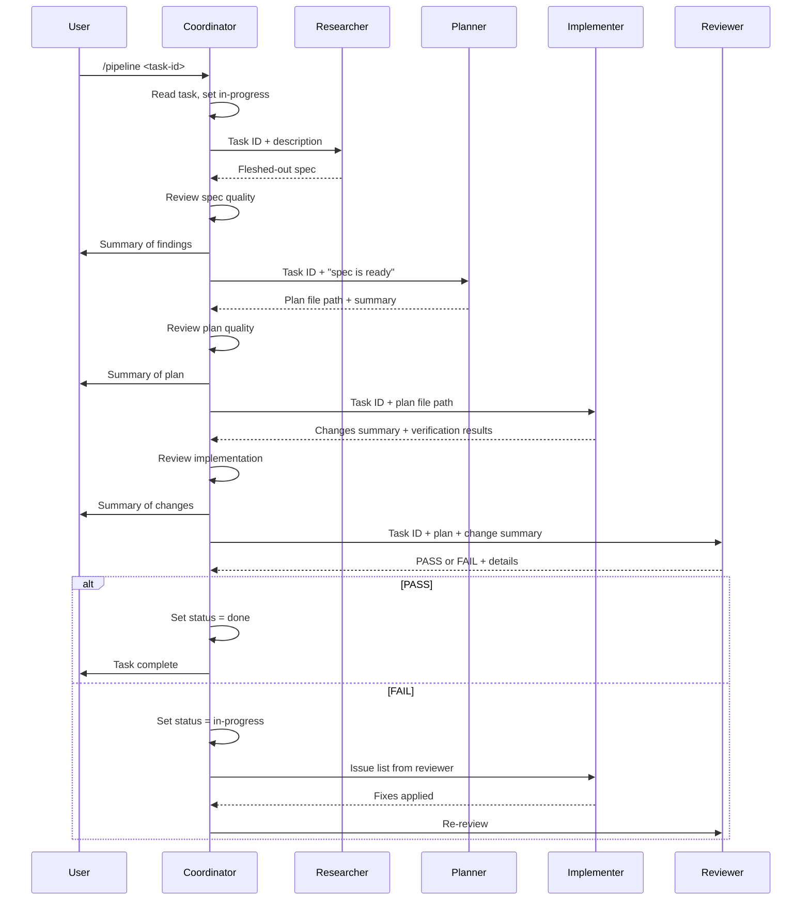
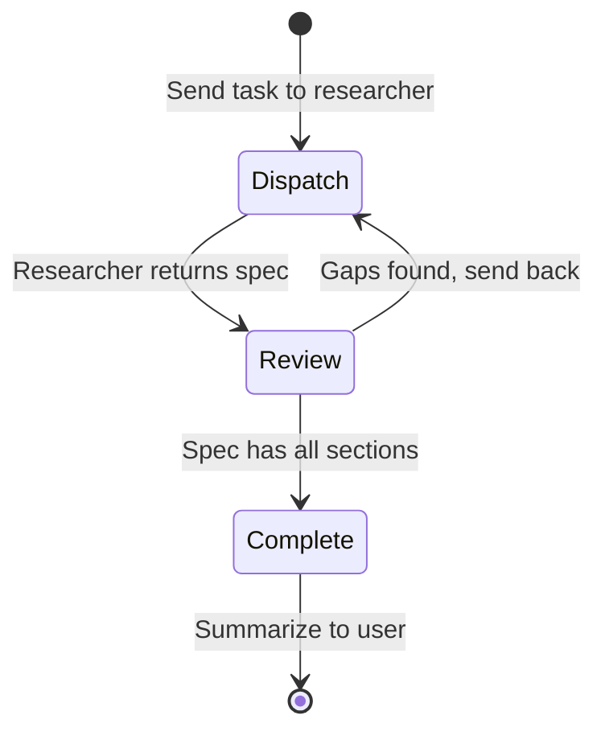
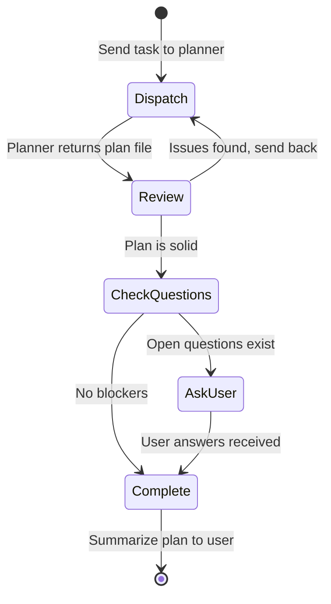
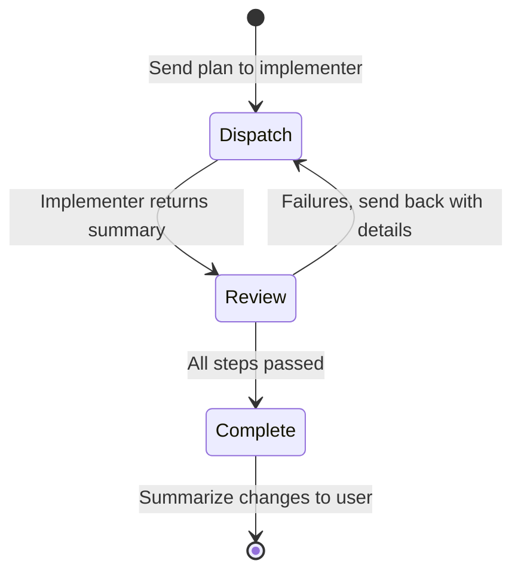
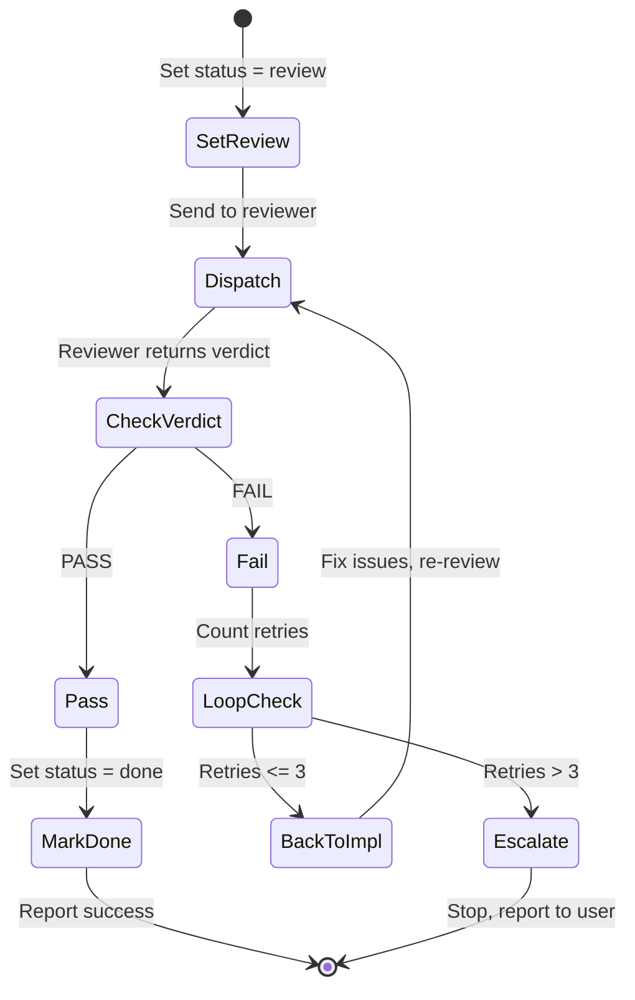

# Pipeline: Full Task Pipeline for a Taskmaster Task

## Overview

Run a Taskmaster task through the full agent pipeline. You are the coordinator -- the central hub. All agents report back to you. You review output at each stage before dispatching the next. You never write code directly.

### Pipeline Stages

```
1. researcher  -- flesh out the task spec
2. planner     -- create technical implementation plan
3. implementer -- execute the plan
4. reviewer    -- verify the work
```

### Pipeline Flow



### Agent Communication



Each stage is a separate agent dispatch. You wait for each agent to finish, review its output, and decide whether to proceed, retry, or stop.

## Step 0: Read the Task

Before starting the pipeline, load the task and set status.

```bash
task-master show $ARGUMENTS
```

```bash
task-master set-status --id=$ARGUMENTS --status=in-progress
```

Show the user the task title, description, and priority. If the task has dependencies that are not yet `done`, warn the user and ask whether to proceed anyway.

If the task description is already a comprehensive spec (has Goal, Current State, Acceptance Criteria, etc.), you may skip Step 1 and go directly to Step 2. Tell the user you are skipping research because the spec is already fleshed out.

## Step 1: Researcher

Dispatch `Agent(subagent_type: researcher)` with the following context:

- The task ID: `$ARGUMENTS`
- The current task title and description
- Instructions: Flesh out the task spec by exploring the codebase and producing a comprehensive specification with these sections: Goal, Current State, Desired End State, Scope, Approach, Key Decisions, Acceptance Criteria, Dependencies & Risks
- Instructions: Update the task in Taskmaster with the full spec using `task-master update-task`

**Review the output.** Read what the researcher returned. Check:

- Did the researcher update the task in Taskmaster?
- Does the spec have all required sections (Goal, Current State, Desired End State, Scope, Approach, Key Decisions, Acceptance Criteria, Dependencies & Risks)?
- Are file paths and code references real (not fabricated)?
- Are there open questions or gaps that would block planning?

If the spec is incomplete or has gaps, resume the researcher agent with specific feedback on what is missing. Repeat until the spec is solid.

Once satisfied, give the user a brief summary of the researcher's findings (3-5 bullet points) and proceed.



## Step 2: Planner

Dispatch `Agent(subagent_type: planner)` with the following context:

- The task ID: `$ARGUMENTS`
- Context: The researcher has fleshed out the full task spec in Taskmaster
- Instructions: Read the task from Taskmaster, deep-dive into the codebase, and create a detailed implementation plan
- Instructions: Save the plan to `.taskmaster/plans/task-$ARGUMENTS-plan.md`
- Instructions: Update the task in Taskmaster to reference the plan file

**Review the output.** Read the plan file at `.taskmaster/plans/task-$ARGUMENTS-plan.md`. Check:

- Does the plan have all required sections (Summary, Research Findings, Files to Change, Implementation Steps, Testing & Verification, Risks & Mitigations)?
- Are implementation steps specific enough for the implementer to execute without doing its own research? Each step should reference exact file paths, function names, and patterns.
- Are file paths real? Spot-check a few by reading them.
- Are steps in dependency order?
- Are there unresolved open questions that would block implementation? If so, present them to the user and wait for answers before proceeding.

If the plan has issues, resume the planner agent with specific feedback. Repeat until the plan is solid.

Once satisfied, give the user a brief summary of the plan (approach in 2-3 sentences, number of files to change, number of steps) and proceed.



## Step 3: Implementer

Dispatch `Agent(subagent_type: implementer)` with the following context:

- The task ID: `$ARGUMENTS`
- The plan file path: `.taskmaster/plans/task-$ARGUMENTS-plan.md`
- Instructions: Read the full plan, execute each implementation step in order, verify each step, and report back with a summary of all changes made
- Any relevant context from the researcher or planner stages that might help

**Review the output.** Read the implementer's summary. Check:

- Did all implementation steps succeed?
- Were there divergences from the plan? If so, are they reasonable or do they indicate a problem?
- Did step-level verification pass for each step?
- Did the final end-to-end verification pass?

If there are issues (failed steps, verification failures, significant unaddressed divergences), send the implementer back with specific details on what needs to be fixed. Repeat until the implementation is solid.

Once satisfied, give the user a brief summary of what was implemented (files changed, key outcomes) and proceed to review.



## Step 4: Reviewer

Set the task status to `review`:

```bash
task-master set-status --id=$ARGUMENTS --status=review
```

Dispatch `Agent(subagent_type: reviewer)` with the following context:

- The task ID: `$ARGUMENTS`
- The plan file path: `.taskmaster/plans/task-$ARGUMENTS-plan.md`
- A summary of what the implementer changed (files created, modified, deleted) and any divergences from the plan
- Instructions: Review the changes via `git diff`, read changed files in full context, check quality criteria (correctness, security, edge cases, conventions, completeness), and return a PASS or FAIL verdict

**Review the verdict.**

### If PASS

Mark the task as done:

```bash
task-master set-status --id=$ARGUMENTS --status=done
```

Report to the user:
- The task is complete
- A brief summary of what was accomplished
- Any minor observations (nits) the reviewer noted
- The final task status

### If FAIL

Set status back to in-progress:

```bash
task-master set-status --id=$ARGUMENTS --status=in-progress
```

Send the reviewer's issue list back to the implementer (Step 3). Include:
- Each issue with its severity, file, line, and description
- The reviewer's suggested fixes
- Instructions to address all critical and warning issues, then report back

Repeat Steps 3 and 4 until the reviewer passes. If the implementer-reviewer loop runs more than 3 times, stop and report the situation to the user -- the task may need to be re-planned or broken into smaller pieces.



## Rules

- **Wait for each agent.** Always wait for an agent to finish and review its output before dispatching the next stage.
- **Show progress.** Give the user a brief summary after each stage so they can see what happened and steer if needed. Keep summaries concise -- key outcomes, not full dumps.
- **Respect user intervention.** If the user speaks up at any point, pause the pipeline and follow their direction. They may want to skip a stage, modify the approach, or stop entirely.
- **Handle large tasks.** If the task looks too large during Step 0 (many unrelated concerns, multiple features bundled together), recommend breaking it into subtasks using `task-master expand --id=$ARGUMENTS` before starting the pipeline. Ask the user before proceeding.
- **Keep status accurate.** The task board is the source of truth. Update status at each transition: `in-progress` at start, `review` when the reviewer begins, `done` on pass, back to `in-progress` on fail.
- **Never write code.** You are the coordinator. All code changes go through the implementer agent. All code review goes through the reviewer agent.
- **Never skip the reviewer.** Every implementation must be reviewed before the task is marked done, no exceptions.